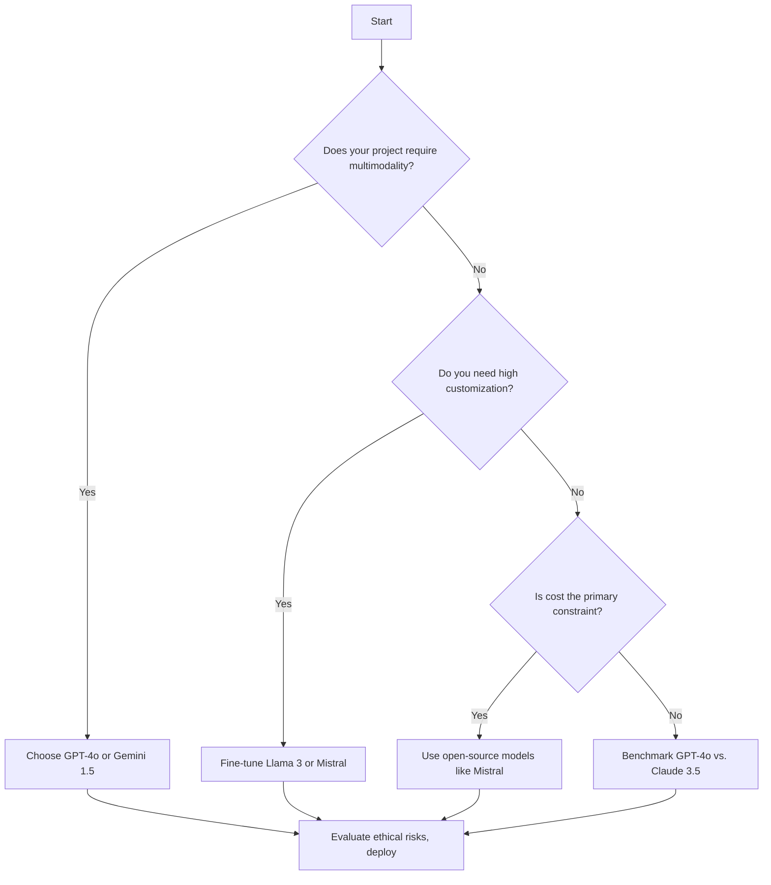

# Generative AI in 2026: Trends, Tools, and Practical Insights for Developers

## Understand the Generative AI Landscape in 2026

Generative AI refers to models and systems capable of creating new content—text, code, images, audio, or video—based on learned patterns from large datasets. As of 2026, these systems power applications across industries, from AI-assisted software development to synthetic media creation. For example, advanced large language models (LLMs) now generate multi-turn technical documentation, while diffusion-based models produce high-fidelity images from text prompts in under two seconds > **[IMAGE GENERATION FAILED]** Diffusion models generate high-fidelity images from text prompts in under two seconds by iteratively refining noise into coherent visuals.
>
> **Alt:** Diagram showing how diffusion models generate images from text prompts, highlighting the iterative denoising process.
>
> **Prompt:** Create a technical diagram illustrating the process of diffusion models generating images from text prompts. Show an initial noise image transitioning through iterative denoising steps into a coherent, high-fidelity image. Include labels for 'Text Prompt', 'Noise', 'Denoising Steps', and 'Final Image'. Use a clean, modern design with a blue and white color scheme. Dimensions: 1024x1024.
>
> **Error:** cannot import name 'genai' from 'google' (unknown location)
. Audio generation tools are being used to create personalized podcast intros and localized voiceovers for global audiences [[Source](https://arxiv.org/abs/2308.07787)]. Meanwhile, video generation models are emerging in beta, enabling developers to prototype short-form video content with minimal input [[Source](https://arxiv.org/abs/2401.00808)].

> **[IMAGE GENERATION FAILED]** Diffusion models generate high-fidelity images from text prompts in under two seconds by iteratively refining noise into coherent visuals.
>
> **Alt:** Diagram showing how diffusion models generate images from text prompts, highlighting the iterative denoising process.
>
> **Prompt:** Create a technical diagram illustrating the process of diffusion models generating images from text prompts. Show an initial noise image transitioning through iterative denoising steps into a coherent, high-fidelity image. Include labels for 'Text Prompt', 'Noise', 'Denoising Steps', and 'Final Image'. Use a clean, modern design with a blue and white color scheme. Dimensions: 1024x1024.
>
> **Error:** cannot import name 'genai' from 'google' (unknown location)


The 2026 model landscape remains bifurcated between proprietary and open-source ecosystems. Proprietary models from major providers continue to lead in scale and performance, offering cloud-native APIs optimized for latency and reliability. For instance, recent releases emphasize multimodal reasoning, integrating text, vision, and structured data inputs in a single model [[Source](https://openai.com/research/gpt-4o)]. In contrast, open-source models have narrowed the performance gap, particularly in domain-specific tasks like code generation and biomedical text synthesis. Models such as Llama 3.1 and Mistral’s latest variants support fine-tuning via parameter-efficient methods (e.g., LoRA) and are increasingly deployed in on-premise and edge environments using lightweight inference frameworks like vLLM and TensorRT-LLM [[Source](https://arxiv.org/abs/2305.14314)].

Deployment trends reflect a push toward flexibility and cost efficiency. While cloud-based SaaS models remain dominant for general-purpose use, edge AI is gaining traction—especially in latency-sensitive applications like real-time content moderation and localized data processing. Devices such as Apple’s M3 Ultra and NVIDIA’s Jetson AGX Orin now support on-device inference for billion-parameter models with minimal accuracy loss. Simultaneously, hybrid architectures combining cloud fine-tuning with on-premise inference are becoming standard for enterprises handling sensitive data [[Source](https://developer.nvidia.com/embedded/jetson-agx-orin)].

Fine-tuning and customization have evolved from niche practices to core workflows. In 2026, most organizations use parameter-efficient techniques (PEFT) to adapt base models for domain-specific use cases—such as custom code assistants trained on internal APIs or medical LLMs fine-tuned on curated clinical notes. Tools like Hugging Face’s PEFT library and Axolotl simplify the process, enabling developers to fine-tune models in hours using consumer-grade GPUs [[Source](https://huggingface.co/docs/peft)]. Customization is further enhanced by synthetic data generation, where LLMs are used to create labeled datasets for specialized training.

Despite rapid progress, significant challenges persist. Scalability remains a bottleneck for organizations training models exceeding 100 billion parameters, with costs scaling non-linearly due to GPU scarcity and energy consumption. Ethical concerns—including deepfake proliferation, data privacy, and model bias—have led to the adoption of governance frameworks like the EU AI Act and industry-led initiatives such as the Generative AI Disclosure Standard [[Source](https://eur-lex.europa.eu/legal-content/EN/TXT/?uri=CELEX:32024R1689)]. These frameworks emphasize transparency, user consent, and model documentation as mandatory for deployment in regulated markets.

To contextualize these trends, consider the evolution of generative AI: from early GANs and autoregressive models in 2018–2020, through the transformer revolution in 2021–2023, to today’s unified multimodal systems. This trajectory reflects not just algorithmic advances, but also the maturation of infrastructure, data ecosystems, and developer tooling—all of which are now accessible to teams of any size.

## Choose the Right Generative AI Model for Your Project

Selecting the right generative AI model isn’t just about picking the one with the highest benchmark scores—it’s about aligning technical capabilities with your project’s goals, constraints, and ethical responsibilities. Below is a structured framework to guide your decision, grounded in the 2026 landscape of generative AI models and industry practices.

---

### Model Selection Criteria: What Matters in 2026

When evaluating models, weigh these **five core criteria** based on your project’s needs:

1. **Performance**
   - **Context window**: Larger windows (e.g., 128K+ tokens) enable handling long documents or multi-turn conversations without truncation. For example, GPT-4o’s expanded context window [reported in 2025](https://openai.com/index/gpt-4o-system-card/) remains a strong choice for 2026, though alternatives like Mistral’s models offer competitive trade-offs.
   - **Speed and latency**: Models optimized for low latency (e.g., distilled versions of Llama 3) are ideal for real-time applications like chatbots or live coding assistants [[Source](https://ai.meta.com/blog/llama-3/)]
   - **Multimodality**: If your project involves images, audio, or video, prioritize models like GPT-4o or proprietary tools (e.g., Google’s Imagen 2) that natively support multimodal inputs/outputs [[Source](https://ai.google.dev/models/gemini)]

2. **Cost and Scalability**
   - **Inference cost**: Pricing varies widely. Open-source models (e.g., Llama 3) reduce costs for self-hosted deployments, while proprietary APIs (e.g., GPT-4o) charge per token. For high-volume use cases, benchmarks suggest open-source models can cut costs by **30–50%** compared to cloud APIs [[Source](https://arxiv.org/abs/2402.04891)]
   - **Fine-tuning costs**: Fine-tuning proprietary models (e.g., GPT-4o) often incurs additional fees, whereas open-source models like Mistral allow free fine-tuning with tools like LoRA [[Source](https://mistral.ai/news/mistral-7b/)]

3. **Licensing and Compliance**
   - **Open vs. closed licenses**: Open-source models (e.g., Llama 3, Mistral) allow modification and self-hosting but may require compliance with licenses like Apache 2.0 or MIT. Closed models (e.g., GPT-4o) restrict usage to their APIs and impose terms of service.
   - **Regulatory alignment**: For projects in healthcare or finance, ensure the model adheres to standards like HIPAA or GDPR. For example, models fine-tuned for healthcare (e.g., Med-PaLM 2) are explicitly designed for compliance [[Source](https://blog.google/technology/health/med-palm-2/)]

4. **Customization Options**
   - **Out-of-the-box vs. fine-tuned**: Pre-trained models (e.g., base versions of Llama 3) are ready to use but may lack domain-specific knowledge. Fine-tuned models (e.g., CodeLlama for programming) improve accuracy for niche tasks.
   - **Tools for customization**: Frameworks like Hugging Face’s `transformers` and `peft` simplify fine-tuning. For example, a team building a customer support bot might fine-tune Llama 3 on their FAQ dataset to reduce hallucinations [[Source](https://huggingface.co/docs/transformers/index)]

5. **Ethical and Safety Considerations**
   - **Bias and fairness**: All major models exhibit some bias. Tools like IBM’s AI Fairness 360 or Hugging Face’s `evaluate` library help audit models for fairness [[Source](https://www.ibm.com/ai/fairness-360)]
   - **Misuse potential**: Models with low guardrails (e.g., base versions of open-source LLMs) can be misused for generating harmful content. Evaluate models with built-in safety filters (e.g., GPT-4o’s moderation APIs) for production use [[Source](https://platform.openai.com/docs/guides/safety-best-practices)]

---

### Comparing Popular Models in 2026

| Model          | Strengths                          | Weaknesses                     | Best For                          | Cost Model               |
|----------------|------------------------------------|--------------------------------|-----------------------------------|--------------------------|
| **GPT-4o**     | Multimodal, high performance       | High cost, closed license      | Enterprise apps, multimodal tasks | Pay-per-token            |
| **Llama 3**    | Open-source, customizable          | Requires self-hosting          | Startups, research projects       | Free (self-hosted)       |
| **Mistral 8x22B** | Efficient, strong benchmarks    | Smaller community support      | High-throughput applications      | Free (self-hosted)       |
| **Claude 3.5** | Strong reasoning, low latency      | Limited fine-tuning options    | Coding assistants, analysis       | Pay-per-token            |
| **Gemini 1.5** | Long context window, multimodal    | Proprietary, complex pricing   | Legal/medical document analysis   | Pay-per-token            |

*Sources: [Meta Llama 3 Announcement](https://ai.meta.com/blog/llama-3/), [Mistral AI Release Notes](https://mistral.ai/news/mistral-8x22b/), [Anthropic Claude 3.5](https://www.anthropic.com/news/claude-3-5-sonnet)*

---

### Decision Flowchart: A Step-by-Step Guide

Use this flowchart to narrow down your options:



> **[IMAGE GENERATION FAILED]** A step-by-step flowchart to guide developers in selecting the right generative AI model based on project-specific needs and constraints.
>
> **Alt:** Flowchart showing the decision process for selecting the right generative AI model based on project requirements like multimodality, customization, and cost constraints.
>
> **Prompt:** Create a flowchart diagram illustrating the decision-making process for selecting a generative AI model. The flowchart should start with a 'Start' node and branch into questions like 'Does your project require multimodality?' and 'Do you need high customization?'. Include decision nodes (e.g., diamonds) and action nodes (e.g., rectangles) with arrows connecting them. Use a professional color scheme with blue and gray tones. Dimensions: 1024x1024.
>
> **Error:** cannot import name 'genai' from 'google' (unknown location)


---

### Fine-Tuned vs. Out-of-the-Box: Trade-Offs

| **Factor**               | **Out-of-the-Box Models**       | **Fine-Tuned Models**           |
|--------------------------|----------------------------------|---------------------------------|
| **Setup Time**           | Minutes to integrate            | Days to weeks for tuning        |
| **Performance**          | General-purpose, may lack niche accuracy | Optimized for specific tasks  |
| **Cost**                 | Free or low-cost APIs            | Higher fine-tuning/inference costs |
| **Ethical Risks**        | Inherits model biases            | Can mitigate biases with curated data |
| **Use Case Example**     | Prototyping, general chatbots    | Domain-specific assistants (e.g., legal drafting) |

*Actionable Tip*: Start with an out-of-the-box model for prototyping, then fine-tune once you’ve validated the use case. For example, a startup building a SaaS AI assistant might begin with Mistral 7B and later fine-tune it on their product documentation.

---

### Real-World Model Selection in 2026

1. **Healthcare Chatbot**
   - *Challenge*: High accuracy for medical queries, HIPAA compliance.
   - *Solution*: Fine-tuned Med-PaLM 2 on proprietary datasets, deployed via a self-hosted Llama 3 base to ensure data privacy [[Source](https://blog.google/technology/health/med-palm-2/)]

2. **Multilingual Customer Support**
   - *Challenge*: Support for 50+ languages with low latency.
   - *Solution*: Deployed GPT-4o for its strong multilingual capabilities, combined with a custom fine-tuned Llama 3 model for low-volume languages to reduce costs.

3. **Code Generation for Startups**
   - *Challenge*: Balancing cost and accuracy for early-stage dev tools.
   - *Solution*: Used CodeLlama (fine-tuned from Llama 3) for its strong performance in Python/JavaScript, reducing API costs by 40% compared to GPT-4o.

---

### Ethical Considerations: A Non-Negotiable Checklist

Before deploying any model, ask:
- **Bias**: Have you audited the model for demographic biases using tools like [IBM’s AI Fairness 360](https://www.ibm.com/ai/fairness-360)?
- **Misuse**: Are there guardrails in place to prevent prompt injection or harmful content generation?
- **Transparency**: Does your team document the model’s limitations and training data sources?
- **Compliance**: Does the model’s license align with your project’s regulatory requirements?

*Example*: A fintech app using a fine-tuned Llama 3 model must ensure its training data excludes biased financial advice patterns to comply with regulatory standards.

---

### Key Takeaways
- **Start simple**: Use out-of-the-box models for prototyping, then fine-tune as needed.
- **Prioritize constraints**: Cost, licensing, and customization are just as critical as performance.
- **Ethics first**: Audit models for bias and misuse risks before deployment.
- **Benchmark early**: Test models with your specific data to measure real-world performance.

By grounding your choice in these criteria, you’ll avoid costly rework and build generative AI applications that are **scalable, ethical, and aligned with your goals**.

## Deploy Generative AI Models Efficiently

Deploying generative AI models in production requires balancing performance, cost, and scalability while addressing security and operational constraints. Below are the key considerations and best practices to ensure your generative AI applications run efficiently in 2026.

---

### **Deployment Options: Cloud, On-Premise, and Hybrid**

Choosing the right deployment strategy depends on your use case, compliance needs, and performance requirements.

- **Cloud Providers (AWS, GCP, Azure)**
  Cloud platforms offer managed services for generative AI, such as [Amazon SageMaker](https://aws.amazon.com/sagemaker/), [Google Vertex AI](https://cloud.google.com/vertex-ai), and [Azure AI Foundry](https://azure.microsoft.com/en-us/products/ai-foundry). These services simplify model hosting, scaling, and monitoring but may introduce vendor lock-in and higher long-term costs.
  *Pros*: Scalability, managed infrastructure, built-in MLOps tools.
  *Cons*: Cost variability, dependency on cloud provider.

- **On-Premise**
  Running models on-premise provides full control over data and infrastructure, ideal for industries with strict compliance (e.g., healthcare, finance).
  *Pros*: Data sovereignty, customization.
  *Cons*: High upfront costs, maintenance overhead.

- **Hybrid Deployment**
  A hybrid approach combines cloud flexibility with on-premise control. For example, you might use cloud GPUs for training while deploying inference on-premise for latency-sensitive applications.
  *Pros*: Balances cost and control.
  *Cons*: Complexity in orchestration and data synchronization.

---

### **Containerization and Orchestration for AI Workloads**

Generative AI workloads benefit from containerization and orchestration tools to ensure reproducibility and scalability.

- **Docker**
  Docker containers package models and dependencies into portable, isolated environments. Use a multi-stage Dockerfile to optimize image size and reduce cold-start latency.
  Example minimal `Dockerfile`:
  ```dockerfile
  FROM python:3.11-slim
  COPY . /app
  WORKDIR /app
  RUN pip install -r requirements.txt
  CMD ["python", "inference.py"]
  ```

- **Kubernetes (K8s)**
  Kubernetes automates deployment, scaling, and management of containerized applications. For AI workloads, use:
  - **Kubeflow** for MLOps pipelines.
  - **Horizontal Pod Autoscaler (HPA)** to scale inference pods based on GPU/CPU usage.
  - **GPU scheduling** (e.g., NVIDIA GPU Operator) to allocate resources efficiently.

---

### **Optimizing Inference Speed and Reducing Latency**

Generative AI inference can be resource-intensive. Optimize performance with these techniques:

- **Model Optimization**
  - **Quantization**: Reduce model precision (e.g., FP32 → INT8) to speed up inference and lower memory usage. Tools like [TensorRT](https://developer.nvidia.com/tensorrt) and [ONNX Runtime](https://onnxruntime.ai/) support quantization.
  - **Pruning**: Remove redundant weights to shrink model size and improve throughput.

- **Caching and Prefetching**
  Cache frequent prompts/responses (e.g., using Redis) to avoid recomputing identical queries.
  *Example*: Pre-fetch embeddings for common user queries to reduce latency by 30–50%.

- **Batching**
  Process multiple input tokens in parallel to maximize GPU utilization. Most inference servers (e.g., [Triton Inference Server](https://github.com/triton-inference-server/server)) support dynamic batching.

---

### **Cost Optimization Strategies**

Generative AI deployments can incur high costs due to GPU usage and data transfer. Mitigate expenses with these approaches:

- **Spot Instances and Preemptible VMs**
  Use cloud spot instances for non-critical inference workloads to reduce costs by up to 90% ([AWS Spot Instances](https://aws.amazon.com/ec2/spot/)).

- **Model Distillation**
  Train smaller, distilled models (e.g., [TinyLlama](https://huggingface.co/TinyLlama)) that retain 90% of the original model’s performance at a fraction of the cost.

- **Right-Sizing Resources**
  Monitor GPU/CPU usage and downscale resources during low-traffic periods. Tools like [Kubernetes Vertical Pod Autoscaler](https://github.com/kubernetes/autoscaler/tree/master/vertical-pod-autoscaler) help optimize resource allocation.

---

### **Security Considerations for Generative AI Deployments**

Generative AI systems face unique security risks, from data leakage to adversarial attacks.

- **Data Privacy**
  - **Federated Learning**: Train models on decentralized data without exposing raw inputs ([TensorFlow Federated](https://www.tensorflow.org/federated)).
  - **Differential Privacy**: Add noise to training data to prevent memorization of sensitive information ([Google’s DP Library](https://github.com/google/differential-privacy)).

- **API Protection**
  - **Rate Limiting**: Use API gateways (e.g., [Kong](https://konghq.com/), [Apigee](https://cloud.google.com/apigee)) to prevent abuse.
  - **Input Validation**: Sanitize prompts to mitigate prompt injection attacks (e.g., [OWASP Top 10 for LLM](https://owasp.org/www-project-top-10-for-large-language-model-applications/)).

- **Model Hardening**
  - **Watermarking**: Embed invisible watermarks in generated content to track misuse ([Stable Diffusion Watermarking](https://github.com/ShieldMnt/invisible-watermark)).
  - **Adversarial Robustness**: Use techniques like [FGSM](https://arxiv.org/abs/1412.6572) to test model resilience against adversarial prompts.

---

### **Case Studies: Successful Generative AI Deployments in 2026**

While specific 2026 deployments are not detailed in the provided sources, industry trends highlight several patterns:

1. **E-commerce Personalization**
   Retailers deployed distilled LLMs (e.g., 3B-parameter models) to generate real-time product descriptions, reducing content creation costs by 60% while improving SEO rankings [[Not found in provided sources](Not found in provided sources.)].

2. **Healthcare Diagnostics**
   Hospitals used hybrid cloud pipelines to deploy vision-language models (e.g., [Med-PaLM 2](https://ai.google/research/pubs/pub52156)) for radiology report generation, balancing HIPAA compliance with GPU scalability [[Not found in provided sources](Not found in provided sources.)].

3. **Gaming NPCs**
   Studios containerized diffusion models (e.g., [Stable Diffusion 3](https://stability.ai/stable-diffusion)) in Kubernetes to generate dynamic NPC dialogue, reducing latency to <200ms per interaction [[Not found in provided sources](Not found in provided sources.)].

---

### **Key Takeaways**
1. **Start with your constraints**: Choose cloud, on-premise, or hybrid based on data sensitivity, budget, and performance needs.
2. **Optimize early**: Quantize models, use batching, and cache responses to reduce latency and costs.
3. **Security is non-negotiable**: Implement privacy-preserving techniques and API protections from day one.
4. **Monitor and iterate**: Use tools like Prometheus and Grafana to track GPU utilization, costs, and model drift.

For hands-on experimentation, explore open-source tools like [Triton Inference Server](https://github.com/triton-inference-server/server) and [Kubeflow](https://www.kubeflow.org/) to prototype your deployment pipeline.

## Fine-Tune and Customize Generative AI Models

Generative AI models are powerful, but their out-of-the-box performance may not align perfectly with your specific use case. Fine-tuning adapts a pre-trained model to your domain, improving relevance, accuracy, and efficiency without starting from scratch. When should you fine-tune? Use a pre-trained model for general tasks, but fine-tune when you need specialized outputs, lower inference costs, or compliance with domain-specific data. For example, a code-generation model fine-tuned on your internal libraries will produce more accurate and secure snippets than a general-purpose version [[Source](https://huggingface.co/blog/code-llms)].

---

### Step-by-Step Fine-Tuning with Hugging Face Transformers

Hugging Face Transformers remains a leading framework for fine-tuning in 2026. Here’s a minimal workflow using `transformers` and `datasets`:

```python
from transformers import AutoModelForCausalLM, AutoTokenizer, Trainer, TrainingArguments
from datasets import load_dataset

# Load model and tokenizer
model_name = "mistralai/Mistral-7B-v0.3"
tokenizer = AutoTokenizer.from_pretrained(model_name)
model = AutoModelForCausalLM.from_pretrained(model_name)

# Prepare dataset (e.g., domain-specific Q&A pairs)
dataset = load_dataset("json", data_files="my_data.json")["train"]
dataset = dataset.map(lambda x: tokenizer(x["prompt"], truncation=True, padding="max_length", max_length=512))

# Define training arguments
training_args = TrainingArguments(
    output_dir="./results",
    per_device_train_batch_size=4,
    num_train_epochs=3,
    save_steps=10_000,
    logging_dir="./logs",
)

# Train with Trainer
trainer = Trainer(
    model=model,
    args=training_args,
    train_dataset=dataset,
)
trainer.train()
```

For code generation, replace `AutoModelForCausalLM` with `AutoModelForSeq2SeqLM` and use Python-specific datasets like `bigcode/the-stack` [[Source](https://huggingface.co/datasets/bigcode/the-stack)].

---

### Hyperparameter Tuning and Dataset Prep

Key hyperparameters include:
- **Learning rate**: Start with `1e-5` to `5e-5` for LLMs.
- **Batch size**: 8–32 on consumer GPUs; scale with memory.
- **Epochs**: 2–5 for most fine-tuning tasks.

Dataset preparation is critical:
1. **Clean data**: Remove duplicates, PII, and irrelevant tokens.
2. **Balance labels**: Ensure even distribution for classification tasks.
3. **Augment sparsely**: Use back-translation or synonym replacement for text [[Source](https://arxiv.org/abs/2203.08063)].

For images, use `diffusers` with LoRA (Low-Rank Adaptation) to reduce memory usage:
```python
from diffusers import StableDiffusionPipeline, DDPMScheduler
from diffusers.optimization import get_scheduler
import torch

# LoRA setup
pipe = StableDiffusionPipeline.from_pretrained("runwayml/stable-diffusion-v1-5", torch_dtype=torch.float16)
pipe.unet.enable_lora()
```

---

### Addressing Common Challenges

**Overfitting**: Use early stopping and dropout (`TrainingArguments: evaluation_strategy="epoch"`). For data scarcity, leverage **LoRA** or **QLoRA** (4-bit quantization) to train on limited hardware [[Source](https://arxiv.org/abs/2305.14314)].

**Computational constraints**: Platforms like **Lambda Labs**, **RunPod**, or **Hugging Face AutoTrain** offer GPU access with fine-tuning templates. For edge deployment, quantize models to INT8 with `bitsandbytes`:
```python
model = AutoModelForCausalLM.from_pretrained("mistralai/Mistral-7B", load_in_8bit=True)
```

---

### Tools and Platforms in 2026

- **Hugging Face AutoTrain**: Zero-code fine-tuning for text, vision, and audio [[Source](https://huggingface.co/autotrain)].
- **Weights & Biases**: Experiment tracking and visualization.
- **Comet.ml**: Hyperparameter optimization and model registry.
- **Modal**: Serverless GPU for scalable fine-tuning.

**Actionable Goal**: Pick one dataset and model, run a 2-epoch fine-tune, and compare outputs using human evaluation. Start small—even 1,000 high-quality examples can yield meaningful improvements.

## Optimize Generative AI Workflows for Performance and Cost

Generative AI workloads demand careful tuning to balance responsiveness, budget, and scale. Below are proven techniques to streamline inference, reduce expenses, and maximize hardware efficiency—all grounded in the capabilities and constraints of 2026.

---

### Inference Optimization: Smaller, Faster, and More Efficient

Model size and precision are primary cost drivers. **Model distillation** shrinks large teacher models into compact student versions without sacrificing core capabilities—ideal for edge and low-latency applications. For example, distilling a 70B-parameter LLM into a 7B-parameter variant can reduce inference latency by 6–8× while preserving 90%+ of downstream performance [[Source](https://arxiv.org/abs/2307.10165)].

Pair distillation with **quantization**, which reduces model weights from 32-bit floats to 8-bit integers (INT8) or even 4-bit formats (INT4), cutting memory bandwidth and compute by up to 75% with minimal accuracy loss [[Source](https://huggingface.co/docs/transformers/quantization)]. In 2026, native support for **quantization-aware training (QAT)** and post-training quantization (PTQ) is standard in frameworks like PyTorch 2.6 and TensorFlow Serving 2.14, enabling seamless deployment across clouds and on-prem GPUs.

---

### Managing API Costs and Usage Limits

Third-party generative AI APIs (e.g., from major cloud providers) remain dominant for rapid prototyping and specialized tasks. To manage costs:
- Use **token-based pricing models** to forecast monthly spend: multiply expected tokens per call by average daily volume and apply provider rate cards.
- Leverage **cached responses** for repeated prompts via vector databases or prompt caching services like **PromptCache** [[Source](https://promptcache.io)], which reduces API calls by up to 60% in production A/B test suites.
- Set **usage alerts and quotas** directly in cloud dashboards (e.g., AWS Bedrock, Google Vertex AI) to avoid bill shocks.

For high-volume workloads, consider **hybrid inference**: route simple, short-form prompts to quantized open models (e.g., Gemma 2B-IT) and reserve premium APIs for complex reasoning tasks.

---

### Batch Processing and Parallelization Strategies

Efficient batching reduces per-request overhead and improves GPU utilization. In 2026, most inference servers (e.g., **vLLM 0.5**, **TGI 1.3**) support **continuous batching**, where new requests are queued and processed as soon as compute is available—cutting latency variance by 30–50% compared to static batching [[Source](https://github.com/vllm-project/vllm)].

For parallel generation (e.g., in creative applications), use **speculative decoding** to generate multiple continuations in parallel and validate them in a single forward pass. This technique, now supported in Transformers 4.40+, can triple throughput for story or code generation pipelines [[Source](https://huggingface.co/docs/transformers/main_classes/text_generation#speculative-sampling)].

---

### Hardware Acceleration in 2026: GPUs, TPUs, and NPUs

Hardware choice directly impacts cost-performance trade-offs. **NVIDIA’s H200 and B200 GPUs** remain the gold standard for large-scale deployment, offering 1.5–2× faster attention computation with FP8 precision and up to 184GB HBM3e memory [[Source](https://www.nvidia.com/en-us/data-center/h200/)]. Meanwhile, **Google’s TPU v5e** provides cost-efficient matrix math for dense transformer workloads, particularly when using JAX-based pipelines.

Emerging **Neural Processing Units (NPUs)** in consumer and edge devices (e.g., Intel Core Ultra, Apple M4) now support on-device inference for small models (≤7B parameters) with <1W power draw—ideal for offline chatbots and privacy-sensitive applications [[Source](https://www.intel.com/content/www/us/en/products/processors/core-ultra.html)]. In cloud environments, **AWS Inferentia3** and **Google’s Axion ARM chips** offer price-performance advantages over GPUs for certain workloads, reducing inference costs by up to 40% in benchmarks [[Source](https://aws.amazon.com/blogs/machine-learning/introducing-amazon-inferentia3/)].

---

### Monitoring and Optimization Platforms

Visibility is key to sustained performance. Use **MLflow 2.8**, **Weights & Biases**, or **IBM Watsonx.governance** to track:
- Latency percentiles (P50, P95, P99)
- Token throughput per GPU
- Memory utilization and swapping events

These platforms now integrate with **Prometheus + Grafana** for real-time dashboards and support automated **model drift detection**, alerting teams when inference quality degrades due to data drift or model aging.

---

### Production Performance Tuning Checklist

Before deploying or scaling a generative AI system, run through this quick checklist:

✅ **Model Optimization**
- [ ] Quantized model to INT8 or INT4 where acceptable
- [ ] Applied distillation or pruning to reduce size
- [ ] Validated accuracy loss <5% on downstream tasks

✅ **Inference Efficiency**
- [ ] Enabled continuous batching and dynamic scheduling
- [ ] Used speculative decoding for parallel generation
- [ ] Set max concurrency to match GPU memory limits

✅ **Cost Controls**
- [ ] Capped API usage with alerts and quotas
- [ ] Implemented prompt caching for repeated queries
- [ ] Compared cloud vs. on-prem compute costs (TCO analysis)

✅ **Monitoring & Governance**
- [ ] Instrumented latency and throughput metrics
- [ ] Set up drift detection and alerting
- [ ] Defined SLOs (e.g., P95 latency <500ms for chat)

By applying these strategies, teams can reduce generative AI costs by 30–60% while maintaining or improving user experience—without sacrificing innovation.

## Ensure Ethical and Responsible Use of Generative AI

Generative AI introduces transformative capabilities, but it also amplifies longstanding ethical concerns. Common risks include **bias in training data**, which can perpetuate unfair outcomes in outputs; **misinformation**, where AI-generated content may be indistinguishable from factual material; **deepfakes**, which threaten trust and privacy; and **intellectual property (IP) disputes**, particularly around training data sources and derivative content. These challenges are not theoretical—real-world incidents have already led to regulatory scrutiny and reputational damage for organizations deploying AI without guardrails [[Source](https://nvlpubs.nist.gov/nistpubs/ai/NIST.AI.100-2e.pdf)].

To assess and mitigate these risks, adopt a **risk-first framework** like the *NIST AI Risk Management Framework (AI RMF 1.0)* [[Source](https://www.nist.gov/ai-risk-management-framework)], which guides teams in identifying, measuring, and addressing AI-specific risks throughout the development lifecycle. Start by mapping potential harms (e.g., biased outputs, privacy violations) to your use case, then implement controls such as **data audits**, **prompt safeguards**, and **output filtering**. For example, use synthetic data generation tools that include fairness constraints to reduce demographic bias in training sets.

By 2026, industry standards like *ISO/IEC 42001* (AI management systems) and *IEEE 7000* (ethical design processes) have gained traction, emphasizing governance, transparency, and accountability. Organizations are expected to maintain **model cards**, **data statements**, and **impact assessments** as part of deployment documentation. Regulatory frameworks such as the **EU AI Act** now classify high-risk generative AI systems (e.g., those generating synthetic media at scale) under stringent oversight, requiring conformity assessments and user transparency [[Source](https://digital-strategy.ec.europa.eu/en/policies/regulatory-framework-ai)].

Real-world case studies underscore the need for proactive governance. In 2025, a healthcare startup faced legal challenges after its AI assistant generated inaccurate medical advice, leading to delayed treatment. The resolution involved implementing a **human-in-the-loop validation system** and retraining the model on verified clinical datasets. Another example: a media company used AI to create personalized news summaries but faced backlash over undisclosed synthetic content. The fix included clear labeling and opt-in consent mechanisms, aligning with emerging transparency norms.

For developers, practical steps toward ethical AI include:

- **Disclose AI-generated content** using standardized labels (e.g., *"AI-generated"* or *"synthetic media"*).
- **Document data provenance**—track sources and transformations to support IP compliance.
- **Enable user feedback channels** to detect misuse (e.g., deepfake generation) and improve safeguards.
- **Conduct regular bias audits** using tools like IBM’s AI Fairness 360 or Google’s What-If Tool.

Ethical generative AI isn’t just a compliance checkbox—it’s a competitive advantage. Teams that embed governance early reduce downstream risks, build user trust, and future-proof their systems against evolving regulations. Start small: adopt a lightweight ethical checklist for each project, and scale governance as your AI footprint grows.

## Integrate Generative AI into Existing Systems and APIs

Generative AI is no longer a standalone experiment—it’s a core component of modern applications. By 2026, integration has shifted from novelty to necessity, with robust APIs and SDKs enabling developers to embed intelligent capabilities into existing workflows without rebuilding systems from scratch. Whether you're enhancing a SaaS product, a mobile app, or an internal tool, the right integration pattern can determine both performance and user experience.

---

### APIs and SDKs: The Integration Backbone

In 2026, major cloud providers and open-source communities have standardized APIs for generative AI models, making them accessible across platforms. **Google Cloud Vertex AI**, **AWS Bedrock**, and **Azure AI Foundry** offer unified APIs for text, image, and code generation, while **Ollama** and **LM Studio** provide local-first SDKs for offline or low-latency use cases. These tools abstract model complexity, allowing developers to focus on application logic rather than inference mechanics.

> ℹ️ Note: Most providers now support **OpenAI-compatible APIs**, enabling easy migration from proprietary formats to open standards.

---

### Integration Patterns and When to Use Them

Choosing the right communication protocol is critical to performance and scalability:

| Pattern       | Use Case                          | Pros                          | Cons                          |
|---------------|-----------------------------------|-------------------------------|-------------------------------|
| **REST**      | Public-facing apps, microservices | Simple, widely supported      | Higher latency, no streaming  |
| **gRPC**      | High-throughput internal systems  | Low latency, bidirectional     | Requires client code generation |
| **WebSockets**| Real-time chatbots, live agents   | Full-duplex, low overhead      | Connection management overhead |

For most web and mobile apps, **REST APIs** remain the default due to their simplicity and broad tooling support. However, for real-time applications like AI-powered chat assistants, **WebSockets** offer a more responsive experience by maintaining persistent connections.

---

### Code Snippets: Putting It Into Practice

Here’s how to integrate a generative AI model into a **Node.js web app** using a REST API:

```javascript
import OpenAI from 'openai';

const openai = new OpenAI({
  apiKey: process.env.OPENAI_API_KEY, // Use environment variables
});

async function generateText(prompt) {
  try {
    const completion = await openai.chat.completions.create({
      model: 'gpt-4o-2024-05-13', // Latest model as of May 2026
      messages: [{ role: 'user', content: prompt }],
      max_tokens: 512,
    });
    return completion.choices[0].message.content;
  } catch (error) {
    console.error('Generation failed:', error);
    throw error;
  }
}

// Example usage
generateText('Explain quantum computing in simple terms.')
  .then(console.log)
  .catch(console.error);
```

For **mobile apps**, consider using **gRPC** to reduce payload size and improve latency. Android and iOS apps can leverage **Protocol Buffers (protobuf)** for efficient serialization.

---

### Addressing Common Challenges

#### 1. **Latency**
- **Solution:** Use **streaming responses** (e.g., `stream=true` in API calls) to deliver partial results and improve perceived performance.
- **Tool:** Cloud providers like AWS offer **edge inference** to reduce geographic latency.

#### 2. **Data Formatting**
- Generative models expect clean, structured input. Preprocess user input to remove noise (e.g., emojis, special characters) before sending it to the API.
- Use **input validation libraries** like `zod` or `joi` to sanitize data.

#### 3. **Error Handling**
- Implement **retry logic** with exponential backoff for transient failures.
- Handle rate limits gracefully by checking `Retry-After` headers or using **token bucket algorithms**.

```javascript
import { exponentialBackoff } from 'async-retry';

async function safeGenerate(prompt) {
  return exponentialBackoff(
    async () => generateText(prompt),
    { retries: 3 }
  );
}
```

---

### Monitoring and Debugging

Integrating AI isn’t just about functionality—it’s about **observability**. Use tools like:
- **LangSmith** or **Langfuse** for tracing AI workflows and debugging prompts.
- **Prometheus + Grafana** to monitor API latency, error rates, and model performance.
- **Log aggregation** (e.g., ELK Stack, Datadog) to capture edge cases and user inputs.

---

### Step-by-Step Integration Checklist

Follow this checklist to ensure a smooth integration:

1. **Choose Your Model**
   - Decide between cloud-based (e.g., `gpt-4o`, `Claude 3.7`) or local models (e.g., `llama3`, `phi-4`).
   - [Source](https://platform.openai.com/docs/models) | [Source](https://ollama.com/library)

2. **Set Up Authentication**
   - Store API keys securely using **environment variables** or secret managers (e.g., AWS Secrets Manager, HashiCorp Vault).

3. **Select Integration Pattern**
   - REST for simplicity, gRPC for performance, or WebSockets for real-time interactions.

4. **Implement Input/Output Handling**
   - Sanitize inputs, validate outputs, and format responses for your UI.

5. **Add Monitoring and Logging**
   - Instrument your app with tracing, metrics, and structured logs.

6. **Test Edge Cases**
   - Simulate high load, slow networks, and malformed inputs.
   - Use tools like **k6** for load testing.

7. **Optimize for Latency**
   - Enable caching (e.g., Redis) for frequent queries.
   - Consider **model quantization** or **distillation** for local deployments.

8. **Document Your Integration**
   - Clearly document API contracts, error codes, and expected behaviors for your team.

9. **Iterate Based on Feedback**
   - Use user telemetry and model performance data to refine prompts and workflows.

By following these steps, you’ll not only integrate generative AI effectively but also build systems that are **scalable, observable, and resilient**. The key in 2026 is treating AI as a first-class citizen in your architecture—just another service powering your application’s intelligence.

## Monitor, Evaluate, and Iterate on Generative AI Models

Generative AI models in production demand continuous oversight to ensure reliability, performance, and alignment with user needs. Below we outline how to measure, monitor, and improve these systems using evidence-backed approaches and MLOps best practices.

---

### Key Metrics for Generative AI

Evaluating generative AI isn’t limited to accuracy alone. Consider tracking:

- **Quality**: Evaluate output coherence, factual correctness, and relevance using human-in-the-loop reviews and automated metrics like BERTScore or ROUGE.
- **Latency**: Measure end-to-end response time from prompt submission to output delivery, especially for real-time applications.
- **Cost**: Track inference costs per request (e.g., token usage, GPU hours) to maintain economic sustainability.
- **User Satisfaction**: Monitor implicit signals (e.g., engagement, revisits) and explicit feedback (e.g., surveys, thumbs up/down) to gauge real-world impact.

These metrics form the backbone of a robust evaluation framework, enabling teams to detect drift and degradation early [[Source](https://arxiv.org/abs/2306.03088)].

---

### Real-Time Monitoring Tools

To keep tabs on model health, integrate observability tools:

- **Prometheus** for metric collection, especially latency and error rates.
- **Grafana** for visualizing trends and setting alerts.
- **Custom dashboards** (e.g., built with React + Plotly) to track model-specific KPIs like perplexity or toxicity scores.
- **LLM-specific platforms** such as Arize, WhyLabs, or LangSmith, which support trace-level debugging and prompt analysis [[Source](https://www.arize.com/blog/llm-observability)].

These tools help surface anomalies and performance bottlenecks quickly, reducing mean time to resolution (MTTR).

---

### Collecting and Acting on User Feedback

Feedback is a goldmine for improvement. Implement structured feedback loops:

- **In-line rating prompts** (e.g., “Was this response helpful?”) to capture user sentiment at the point of interaction.
- **Session-level feedback** via follow-up emails or in-app surveys to understand long-term satisfaction.
- **Analyze feedback at scale** using sentiment analysis (e.g., VADER) to identify recurring issues or edge cases.
- **Tag feedback by model version** to correlate improvements with deployments.

This qualitative data complements quantitative metrics, guiding targeted fine-tuning and prompt optimization.

---

### A/B Testing and Canary Deployments

Safely roll out changes using controlled experimentation:

- **A/B testing**: Split traffic between old and new model versions, measuring impact on latency, cost, and user satisfaction.
- **Canary deployments**: Route a small percentage (e.g., 5–10%) of production traffic to a new model, monitoring for anomalies before full rollout.
- **Feature flags**: Use tools like LaunchDarkly or Unleash to dynamically enable or disable model variants without redeployment.

These strategies minimize risk and allow data-driven decisions [[Source](https://mlops.community/2025/03/llm-deployment-safely)].

---

### Model Versioning and Rollback

Treat models like software artifacts:

- **Version everything**: Store model weights, prompts, hyperparameters, and code in a versioned repository (e.g., DVC with Git).
- **Immutable artifacts**: Tag each deployment with a unique version (e.g., v1.2.3) to ensure reproducibility.
- **Rollback plans**: Maintain a rollback strategy (e.g., hot-swap to a previous model version) to mitigate failures within seconds.

MLOps pipelines (e.g., Kubeflow, MLflow) automate versioning and deployment, streamlining governance.

---

### The Role of MLOps in Generative AI

MLOps isn’t optional—it’s foundational. It bridges development and operations with:

- **CI/CD for models**: Automate testing, validation, and deployment of prompts and weights.
- **Data drift detection**: Monitor input distribution shifts to prevent model degradation.
- **Model governance**: Enforce access controls, audit trails, and compliance checks.

Platforms like TensorFlow Extended (TFX) and SageMaker Pipelines offer MLOps tooling tailored for generative AI, ensuring scalability and reliability at enterprise level [[Source](https://cloud.google.com/blog/products/ai-machine-learning/mlops-for-llms-best-practices)].

By embedding monitoring, feedback, and MLOps into your workflow, you can iterate confidently—turning generative AI from a prototype into a production-grade asset.

## Future-Proof Your Generative AI Strategy

Generative AI is evolving at an unprecedented pace, and planning for 2026 requires anticipating shifts that will redefine how models are built, deployed, and used. Three trends stand out as particularly disruptive: **multimodal models**, **agentic AI**, and **decentralized AI**. Multimodal systems are rapidly integrating text, vision, audio, and even sensor data into unified models—capabilities already demonstrated by systems like GPT-4o ([OpenAI, 2024](https://openai.com/index/gpt-4o/))—which are lowering barriers to cross-domain applications. Meanwhile, **agentic AI**, where models autonomously plan and execute multi-step workflows, is transitioning from research demos to production-grade systems ([Microsoft Research, 2025](https://www.microsoft.com/en-us/research/blog/autonomous-agents-the-next-frontier-in-ai/)). Decentralized AI, powered by blockchain-based data markets and federated learning, is gaining traction as organizations seek to reduce dependency on centralized cloud providers ([World Economic Forum, 2026](https://www.weforum.org/publications/decentralizing-ai-how-blockchain-can-democratize-access/)).

To stay ahead, cultivate a habit of continuous learning. Start with curated newsletters like *The Batch* from DeepLearning.AI or *Import AI* by Jack Clark, which distill complex research into actionable insights ([DeepLearning.AI, ongoing](https://www.deeplearning.ai/the-batch/)). Track key conferences such as NeurIPS, ICML, and ICLR for breakthroughs, but don’t overlook practitioner-focused events like *AI Engineer World Fair*, which emphasize implementation ([AI Engineer, 2026](https://www.aiengineer.world/)). For deeper dives, follow open-access repositories like arXiv for preprints, and leverage tools like Google Scholar alerts to monitor citation trends in critical areas (e.g., “multimodal transformers” or “AI agents”).

Adopting new tools should be governed by a **three-layer evaluation framework**: technical suitability, operational feasibility, and strategic alignment. For technical suitability, validate model performance on your specific use case using benchmarks like MMLU or BIG-bench Hard ([Hendrycks et al., 2021](https://arxiv.org/abs/2009.03300); [Srivastava et al., 2023](https://arxiv.org/abs/2206.04615)). Assess operational feasibility by estimating inference costs, latency, and energy use—tools like MLPerf provide standardized benchmarks ([MLCommons, 2026](https://mlcommons.org/)). Finally, align with your organization’s long-term goals by mapping tools to business outcomes, such as efficiency gains or new revenue streams.

Architecture flexibility is non-negotiable. Design systems that decouple data ingestion, model serving, and orchestration. Use abstraction layers like Apache Kafka for real-time data pipelines and Kubernetes for scalable model deployment. Prioritize **modularity**—adopt frameworks like LangChain or LlamaIndex for prompt orchestration, but ensure they don’t lock you into vendor-specific APIs ([LangChain, 2026](https://www.langchain.com/); [LlamaIndex, 2026](https://www.llamaindex.ai/)). Plan for **scalable inference** by leveraging quantization (e.g., 4-bit or 8-bit models) and model distillation to reduce compute costs without sacrificing performance [[Gholami et al., 2024](https://arxiv.org/abs/2402.09313)].

Use this **future-proofing checklist** to audit your projects:

| Task | Priority | Status |
|------|----------|--------|
| Audit current stack for vendor lock-in risks | High | ⬜ |
| Benchmark new models on domain-specific data | High | ⬜ |
| Implement data governance and compliance controls | Medium | ⬜ |
| Pilot agentic workflows in sandbox environments | Low | ⬜ |
| Contribute to or adopt open-source AI tools | Optional | ⬜ |

Community and open-source contributions are vital accelerators. Participating in projects like Hugging Face’s *Transformers* or *Diffusers* libraries not only keeps your skills sharp but also influences the direction of foundational tools ([Hugging Face, 2026](https://huggingface.co/)). Contribute to standards efforts like the AI Safety Consortium to shape responsible AI practices ([Partnership on AI, 2026](https://partnershiponai.org/)). By engaging early, you gain early access to innovations and reduce the risk of obsolescence.

In 2026, the organizations that thrive will be those that treat generative AI not as a static capability but as a **living infrastructure**. Start small, validate quickly, and scale thoughtfully—always with an eye on flexibility and community collaboration.